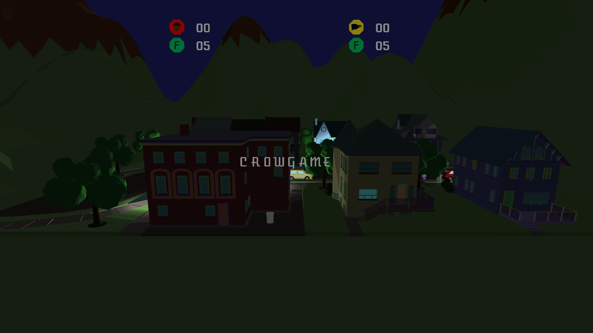

# crowgame

By Addison BG (Programming) & Holie H (Art)

This game was made in a year, along side and with the [Opulence Graphics engine](https://github.com/addisonbgross/opulence). This is an experiement in
creating a game without direction.

## screenshots

### things you need
* OpenGL 3.3+
* SDL2
* GLSL 1.3+
* MinGW 32-bit (for Windows users)
* CMake
* patience

<<<<<<< HEAD
### run this thing
Overwrite the CMakeLists.txt file in Opulence with the CMakeLists.txt file in this folder.
Compile using CMake in the Opulence folder. Your output game executable will be generated
in the Opulence folder

#### that font
https://github.com/EbenSorkin/Atomic-Age
